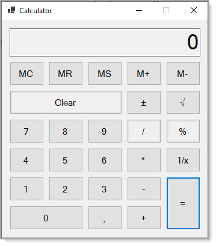

# About

This is a very basic calculator originally done with `.NET Framework 4.7.2`. Karen ran the project through Microsoft upgrade assistant which was successful yet had some issues.

Since there was a problem displaying the form, Karen created a new form, manually edited the form's designer file `not wise to do` unless (**a**) there is a backup (**b**) you know how to perform this type of operation. Also note when working with the designer `do not` add any custom code, custom code must be placed into the form.cs file.

👉 `Karen Payne` did not create this project, only migrated it to `.NET Core`.

---

 &nbsp;&nbsp;
&nbsp;&nbsp;

